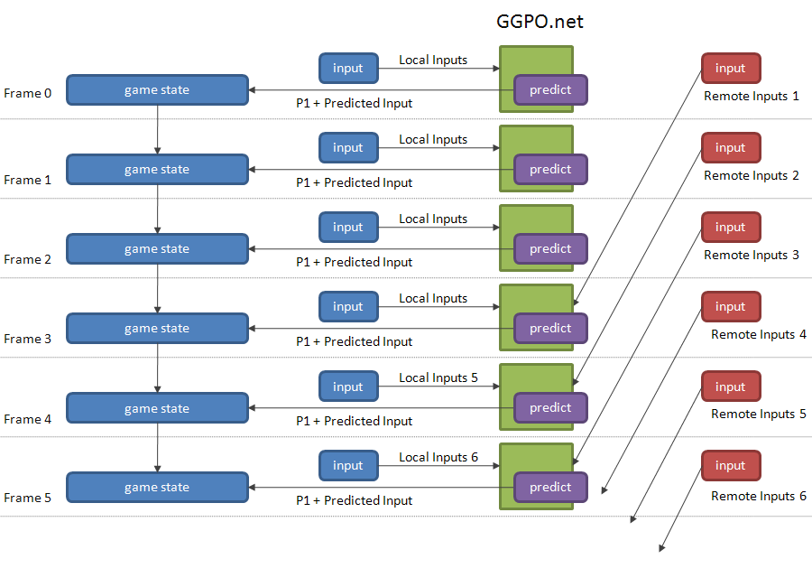
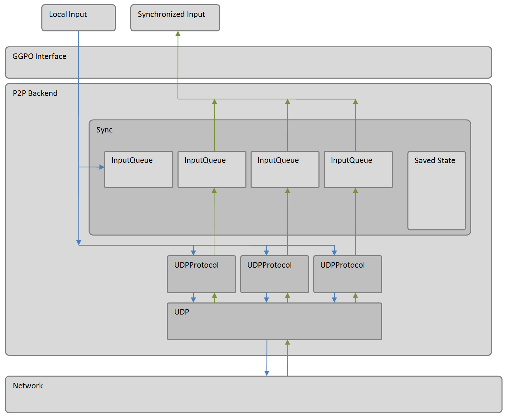

# GGPOとは？

2009年に開発されたGGPOネットワーキングSDKは、ピアトゥピアゲームにおけるロールバックネットワーキング実用化の先駆けとなったシステムです。正確な入力や、フレームごとの完璧な処理を必要とし、ゲーム展開が速くかつ配信に適したゲームにおいて、ネットワーク遅延を目立たなくさせることに重点を置いて開発されました。

従来の技術はプレイヤーの入力に遅延を織り込んで通信を行っており、その結果反応が遅く、ラグを感じるプレイ感になっていました。ロールバックネットワーキングはプレイヤーの入力を即座に送信するため、入力予測と投機的実行を行うことにより、遅延ゼロの回線環境をもたらせるのです。ロールバックがあれば、タイミングや相手の動きや効果音に対しての反応、指が覚えている入力、これらオフラインで行えた内容が、そのままオンラインでも行えます。GGPOネットワーキングSDKは、ロールバックネットワーキングを新作や発売されているゲームに極力簡単に組み込めるよう作られています。

# どう動作する？

ロールバックネットワーキングは決定的ピアトゥピアエンジンに統合できるよう設計されています。 完全に決定的なエンジンなら、同じ入力をした場合にゲームは必ず同じ内容のプログラム再生をします。 その内容を実現する一つの方法としては、ネットワーク上に全プレイヤーと入力をやりとりをする方法があげられますが、これは全プレイヤーがピアから全入力を受け取った時にゲームプレイロジックが1フレームだけ実行する形になります。 この方法ではゲーム内でキャラの動きがぎくしゃくし、応答が重たいゲーム内容になりがちです。 ネットワークを介して入力を受け取る時間が長ければ、ゲーム展開も遅くなってしまいます。

## 入力遅延を用いたネットワーキング

### 理論上では…

下にある図を見てください。2つのクライアントが理想的なネットワークで0ミリ秒の遅延の中、同期されている図になっています。1プレイヤー側の入力が青、2プレイヤー側の入力は赤、ネットワーク層は緑です。黒色の矢印は入力がシステム内で送信され、ゲームステートが次へと推移する流れを示します。各フレームは水平のダッシュ線で分けています。図は1プレイヤー側から見た図だけになっていますが、2プレイヤー側からも全く同じ手順になっています。

1プレイヤーの入力は、ネットワーク層によって2プレイヤーの入力とマージし、ゲームエンジンに送信されます。エンジンはその入力を用いて現在のフレームのゲームステートを変更します。2プレイヤー側も同様です。1プレイヤーの入力をマージして入力をゲームエンジンに送信します。プレイヤーの入力した値に応じてロジックをあてはめ、過去のフレームのゲームステートを修正しながら、フレームごとにゲームが進行します。1プレイヤーと2プレイヤー両方が同じゲームステートで、それぞれのエンジンに送信される入力が同じなので、両プレイヤーのゲームステートは毎フレーム同期されたままになります。

### 実際は…

理想的なネットワーク例は、パケットがネットワークを介して即座に送信されるものとされていますが、実際にはそこまで理想的に動いているわけではありません。典型的なブロードバンド接続は、プレイヤー間の距離やプレイヤーの住む場所にあるインフラの品質に応じ、パケットの送信が5~150ミリ秒かかります。ゲームが1秒間に60フレームで実行されるとするならば、どこでも1~9フレームの遅延が発生します。

両プレイヤーの入力を受信するまで、ゲームはフレームを処理することができないので、各プレイヤーの入力に1~9フレームの遅延、または「ラグ」を用いなくてはいけません。遅延を考慮に入れ、先ほどの図を変更してみると…

この例では、パケットの送信に3フレームかかります。2プレイヤーによって遠隔から送信された入力は、1フレーム目に1プレイヤー側に届かず、3フレーム後になるまで2プレイヤーの入力は1プレイヤー側のゲーム機に届きません。1プレイヤー側のゲームエンジンは入力を受信するまでゲームを進めることができないので、1フレーム目を3フレーム分遅延せざるをえなくなります。続きのフレームも同様に3フレーム分遅延が発生します。両プレイヤー間で送信される送信時間のために、多くのケースでネットワーク層はマージされた入力を遅延せざるを得なくなります。理想的なネットワーク環境を除いては、大半のゲームジャンルにおいてこのラグによりプレイ感に大きく影響を与えることとなります。

## ロールバックネットワーキングで入力遅延を取り除く

### 投機的実行

GGPOは投機的実行を用いることで、パケット送信に必要となる遅延を隠し、入力ラグの発生を防ぎます。それでは、もう一つの図を見てみましょう。

遠隔のプレイヤーから入力が届くのを待つ代わりに、GGPOが過去の入力をベースに他プレイヤーが行いそうな入力を予測します。予測された入力と1プレイヤーの入力を統合し、即座にマージされた入力がゲームエンジンに通るので、仮に他プレイヤーの入力情報があるパケットが届かなくとも次のフレームへ進めることができます。
GGPOの予測が完璧であれば、オンラインで遊ぶユーザー体験はオフラインと同一のものになります。もちろん、未来を予測することは誰にもできません！GGPOも時々2プレイヤーの入力を間違って予測します。上の図をもう一度ご覧ください。もしGGPOが1フレーム目に2プレイヤーの異なる入力を送信したとしたら？1プレイヤー側に表示される2プレイヤーの入力は、2プレイヤー側で表示されるものと異なってしまいます。両サイドのゲームは同期から外れ、プレイヤーは違ったゲーム画面を見ながら相手の動きに反応することになります。同期のズレは、1プレイヤー側が2プレイヤーの本来の入力が届く4フレーム目まで発見することができないのですが、もうそうなると手遅れになりかねません。
そういうことから、GGPOの手法は「投機的実行(speculative execution)」と呼ばれます。遊んでいるプレイヤーが見ているその時の情報は正しいかもしれませんが、そうでないこともあり得ます。GGPOが遠隔プレイヤーの入力を誤って予測した場合、次のフレームへ進める前にエラーをただす必要があります。次の例は、どのように発生するかを説明します。

### 投機的実行エラーをロールバックで修正する

GGPOは遠隔プレイヤーがするであろう入力が間違っていたら、クライアントを再同期するためにロールバックを用います。「ロールバック」という単語は、ステートを巻き戻し、プレイヤーの入力に関する、より正しく新しい情報を元に結果を予測した過程を指します。前回のセクションでは、遠隔の入力1における予測したフレームが異なっていたらどうなるか、ということを考えました。それでは、GGPOがエラーを修正する過程を見てみましょう。

GGPOは遠隔の入力を受信したら、その都度前回のフレームで予測した品質をチェックします。先ほど触れたように、GGPOは4フレーム目まで2プレイヤー側の入力が届きません。4フレーム目で、GGPOは以前に予測した入力とネットワークから受信した入力が一致しないことに気づきます。両サイドのゲームを再同期するため、GGPOは3フレーム分の誤った入力によって発生したダメージや間違いを取り消す必要があります。誤って予測した入力を送信する前のフレームまで戻るよう、ゲームエンジンに要求します(つまり過去のステートまで「ロールバック」する)。 以前のステートを復元したら、GGPOはエンジンに正しい入力で1フレーム進めるよう要求します。このフレームは空色で示しています。ゲームエンジンはこのフレームをユーザーに見えない形で出来る限り素早く進める必要があります。例えば、ビデオレンダラーはこのフレームを画面に描写するべきではありません。オーディオレンダラーは原則、音声を生成し続けるべきですが、ロールバックが終わるまでレンダーするべきではなく、サンプルが生成されたフレームを引いた現在のフレームであるnフレームでサンプルがスタートする必要があります。エンジンはGGPOがエラーを見つける前のフレームまで到達したら、GGPOがロールバックモードをやめ、ゲームを通常通り進めることを許可します。図の5フレームと6フレーム目はGGPOの予測が正しく行われた場合を示しています。ゲームステートが正しいので、ロールバックをする理由はありません。

# コード構造

次の図はGGPOセッションで主に動作するパーツを示したもの、また各パーツごとの関連性を示しています。各コンポーネントの詳細は以下に示しています。

## GGPOインタフェース(GGPO Interface)

GGPOインターフェイスはP2Pと同期テストバックエンド間の詳しい実行を抽象しています。適切なバックエンドは`ggpo_start_session`か`ggpo_start_synctest`エントリーポイントを呼び出した時に、自動的に生成されます。

## P2Pバックエンド(P2P Backend)

P2Pバックエンドはプレイヤー間でゲームを統合します。`ggpo_start_session` APIの呼び出しによって生成されます。大きな情報の処理の大半は含まれているヘルパークラスによってなされます。

## ポルオブジェクト(Poll Object)

(図にはありません)ポルオブジェクトはコード内で他のオブジェクトによって用いられる認証方式です。大気可能なオブジェクトが準備できたときに通知とタイマーを送信します。例としてUDPバックエンドは新たなパケットが到着したときに、通知を受信するためポルオブジェクトを使用します。

## 同期オブジェクト(Sync Object)

同期オブジェクトはゲームステートのnフレームを追跡するために用いられます。埋め込まれた予測（prediction）オブジェクトが予測エラーを通知された時、同期バックエンドがより正確なステートまでゲームを巻き戻し、予測エラーを正そうとシングルステップ処理を進めます。

## 入力キューオブジェクト(Input Queue Object)

入力キューオブジェクトはローカル、または遠隔プレイヤー向けに受信した全入力を追跡します。所持していない入力を要求された場合、入力キューは次の入力を予測し、後の情報を追跡します。そうすることで同期オブジェクトは予測が誤った場合にどこまでロールバックすればいいかわかります。リクエストがあった場合、入力キューはフレーム遅延も実行します。

## UDPプロトコルオブジェクト(UDP Protocol Object)

UDPプロトコルオブジェクトは両プレイヤー間の同期と入力エクスチェンジプロトコルを扱います。また、ゲーム入力圧縮と信頼できるUDP層の実行も行います。各UDPプロトコルオブジェクトには同期オブジェクトが含まれ、そのオブジェクトをプレヤーの間の時間ずれを推測するために利用しています。

## UDPオブジェクト(UDP Object)

UDPオブジェクトは単純なUDPパケットセンダー・リレシーバーです。違うプラットフォームへの移植を簡易にするために、UDPプロトコルから分離します。

## 同期テストバックエンド(Sync Test Backend)

(図にはありません)同期テストバックエンドは、P2Pバックエンドがアプリのセーブステートと決定的に機能上実行していることを確認するときに同じ同期オブジェクトを使用します。同期テストの使用に関する詳しい情報は、開発者向けガイドをご覧ください。
